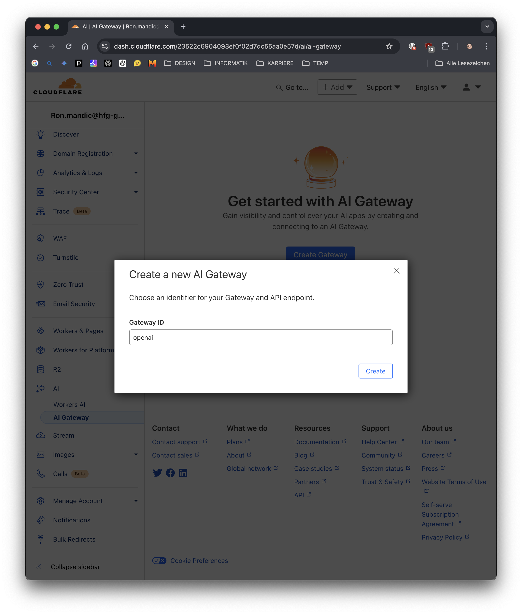
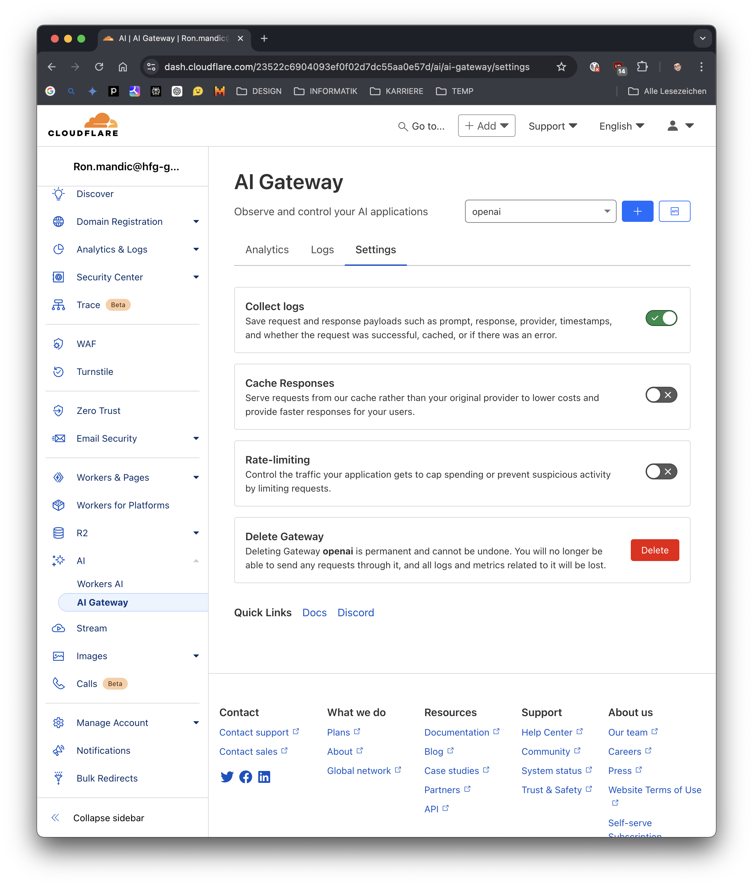
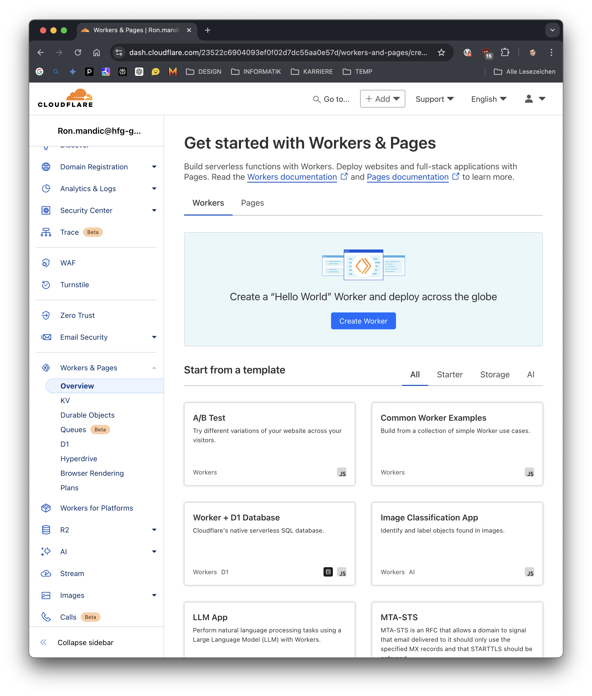
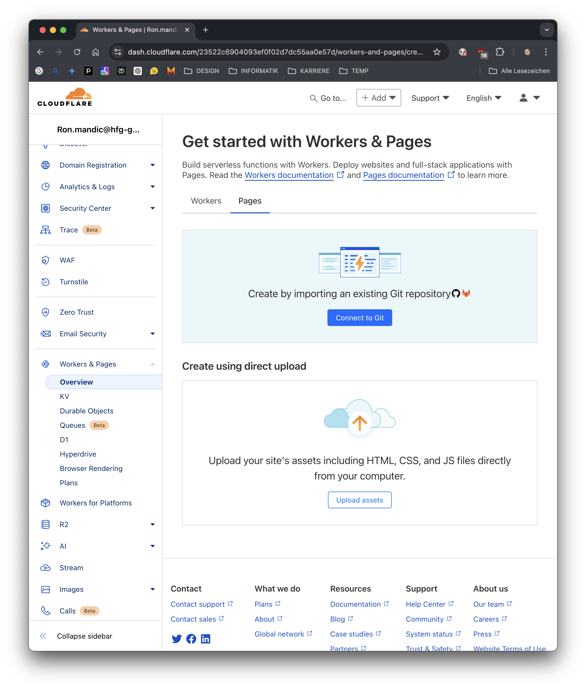

# Cloudflare

## Overview

- Using Cloudflare Workers as sort of middleware for your API requests
- AI Gateway with features like logs, caching responses or rate limiting

## C3 (create-cloudflare-cli)

### Create a worker

```bash
> npm create cloudflare@latest
```

### Upload environment variable

```bash
> npx wrangler secret put OPENAI_API_KEY
```

### Deploy a worker

```bash
> npx wrangler deploy
```

## AI Gateway

An AI Gateway tunnels your AI requests through Cloudflare so you can
get logs, caching, rate limiting, and more. It is a separate endpoint
that you create in Cloudflare and then you connect your application
to it by including the endpoint URL in your worker.



- Retrieve link (e.g. `https://gateway.ai.cloudflare.com/v1/...`)
via `<PROJECT_NAME> API endpoints`
- Replace the base_url property with the new link
- If given, delete any unique identifiers such as ids from the response
so Cloudflare can cache your data



## GUI



## Git and hosting


